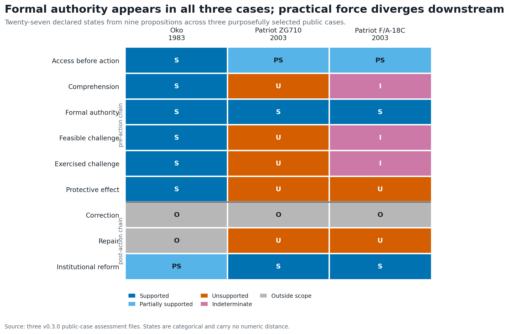

# Trust, Autonomy, and Evidence

[](RESEARCH_STATUS.md)
[](https://github.com/mj3b/trust-autonomy-evidence/releases)
[](https://doi.org/10.5281/zenodo.21841127)
[](https://github.com/mj3b/trust-autonomy-evidence/actions/workflows/validate.yml)
[](LICENSE)
[](https://orcid.org/0009-0001-8121-2878)

## The problem

Institutions increasingly allow AI systems to recommend, plan, communicate, or act across consequential workflows. Claims that these systems are trusted, trustworthy, or subject to human control often leave the evidentiary test unspecified.

This repository asks:

> **What evidence justifies reliance on an autonomous AI system, and what evidence shows that institutional authority can still detect, interrupt, correct, and repair its actions?**

The project develops an evidence architecture for bounded reliance. It identifies the object of reliance, the action being permitted, the governing conditions, and the records an independent reviewer would need to inspect.

## Current contribution

[Version 0.3.0](https://github.com/mj3b/trust-autonomy-evidence/releases) contributes eight connected artifacts:

1. A conceptual model separating trust, trustworthiness, reliance, justified reliance, and calibration.
2. A six-variable autonomy profile covering goal scope, action authority, temporal horizon, impact radius, oversight distance, and reversibility.
3. A seven-level evidence ladder from assertion through longitudinal accountability.
4. A documentary test for practical human control across access, comprehension, authority, feasibility, exercise, effect, correction, repair, and reform.
5. A solo-validation suite containing 12 synthetic cases, 252 prespecified determinations, 12 mutation tests, three invariance tests, and sealed oracle artifacts.
6. A frozen public-case selection protocol with preserved candidate inputs, search output, exclusions, and selection decisions.
7. Three public evidence packets covering a successful pre-action intervention, formal authority without practical force, and an action sequence whose cause remains indeterminate.
8. A frozen research agenda focused on practical authority, evidence sufficiency, and interacting control conditions.

All 252 determinations and 12 mutation tests pass under the committed contract. The v0.3.0 validator also checks source references, packet hashes, frozen selection invariants, and three cross-case control interactions. These results establish deterministic behavior and traceable bounded assessments for the included artifacts. They do not establish independent reliability, field validity, institutional effectiveness, or improved outcomes.

An unreleased publication package adds four main figures and two appendix figures generated from the committed v0.3.0 and v0.2.0 artifacts. Each image has a derived CSV, an SVG for paper production, a PNG preview, a formal caption, and an explicit interpretation boundary. The package changes no release finding.

## Featured figure

Figure 2 shows the repository's central cross-case result. All three cases contain formal human authority. The remaining pre-action conditions determine whether that authority can change the system's path before execution.

[](figures/generated/fig-2-practical-control-chain.svg)

The [publication figure set](figures/) contains the remaining main figures, both appendix figures, their derived data, and short descriptions.

## Repository map

| Path | Purpose |
| --- | --- |
| [`README.md`](README.md) | States the research question, current result, reading order, and validation commands. |
| [`RESEARCH_STATUS.md`](RESEARCH_STATUS.md) | Records the release state, completed artifacts, active work, and open empirical questions. |
| [`CLAIMS.md`](CLAIMS.md) | Lists each proposition with its evidence, confidence, limits, and reversal conditions. |
| [`LIMITATIONS.md`](LIMITATIONS.md) | Names validity threats and conclusions outside the current evidence. |
| [`SOURCES.md`](SOURCES.md) | Records the standards, papers, and public repositories used by the project. |
| [`CITATION.cff`](CITATION.cff) | Provides machine-readable authorship, release, license, and DOI metadata. |
| [`CHANGELOG.md`](CHANGELOG.md) | Tracks material changes to concepts, protocols, claims, and evidence requirements. |
| [`CONTRIBUTING.md`](CONTRIBUTING.md) and [`GOVERNANCE.md`](GOVERNANCE.md) | Define contribution evidence, review rules, decision authority, and change records. |
| [`research/`](research/) | Contains the main conceptual paper on justified reliance, autonomy, and practical control. |
| [`research/frozen-research-agenda.md`](research/frozen-research-agenda.md) | Freezes three research topics and one project question for the next public-case cycle. |
| [`evidence/`](evidence/) | Contains the trust evidence register that converts reliance claims into inspectable records. |
| [`protocols/`](protocols/) | Defines solo validation, independent review, and practical-control assessment procedures. |
| [`protocols/public-case-reconstruction-protocol.md`](protocols/public-case-reconstruction-protocol.md) | Freezes the source cutoff, candidate pools, eligibility rules, screening order, and reconstruction procedure before case selection. |
| [`cases/`](cases/) | Publishes three case packets, their provenance manifests, assessments, hashes, and admissibility requirements. |
| [`cases/public-case-selection-register.md`](cases/public-case-selection-register.md) | Preserves the frozen collection hashes and every inclusion or exclusion in screening order. |
| [`cases/data/candidate-search-output.json`](cases/data/candidate-search-output.json) | Preserves the deterministic search result from the two candidate collections without redistributing article text. |
| [`schemas/`](schemas/) | Contains seven JSON Schemas defining synthetic and public-case assessment contracts. |
| [`fixtures/`](fixtures/) | Contains 12 synthetic cases and the controlled mutation suite. |
| [`oracles/`](oracles/) | Stores prespecified expected decisions and the SHA-256 manifest that seals them. |
| [`analysis/`](analysis/) | Implements the deterministic assessment logic and solo-validation runner. |
| [`assessments/`](assessments/) | Stores generated machine-readable assessment results. |
| [`reports/`](reports/) | Publishes the solo-validation and three-case reconstruction results with explicit claim boundaries. |
| [`figures/`](figures/) | Publishes four main figures, two appendix figures, their derived data, plotting specifications, and short descriptions. |
| [`reports/figure-methods.md`](reports/figure-methods.md) | Records formal captions, transformations, missingness treatment, and prohibited interpretations for the figure set. |
| [`scripts/`](scripts/) | Contains candidate-search, packet-sealing, release-manifest, and repository-validation utilities. |
| [`release/`](release/) | Seals the v0.3.0 research artifacts and their SHA-256 digests. |
| [`mappings/`](mappings/) | Relates this work to GDI, HIT, CDFI, and CDCF governance artifacts. |
| [`.github/`](.github/) | Defines automated validation, the pull-request checklist, and structured issue forms. |
| [`requirements-dev.txt`](requirements-dev.txt) and [`LICENSE`](LICENSE) | Pin the validation dependency and state the Apache-2.0 license. |

## How to read the repository

Start with [Trust, Autonomy, and Evidence](research/trust-autonomy-and-evidence.md). Use the [Trust Evidence Register](evidence/trust-evidence-register.md) to translate a reliance claim into inspectable evidence. Read the [public-case report](reports/public-case-reconstruction-v0.3.0.md), [CLAIMS.md](CLAIMS.md), and [LIMITATIONS.md](LIMITATIONS.md) before applying the model.

The four protocols define solo validation, public-case reconstruction, practical-control assessment, and future independent evaluation. The public-case selection register must record its freeze commit before candidate screening begins. The mapping files show how this project relates to existing public artifacts without transferring claims among them.

## Repository validation

Install the pinned development dependency and run the validator with Python 3.10 or later:

```bash
python -m pip install -r requirements-dev.txt
python scripts/validate_repository.py
```

The validator checks required files, internal Markdown links, version alignment, duplicate claim identifiers, exclusion of private candidacy language, JSON Schema conformance, source references, sealed packet and release hashes, selection invariants, three public-case interactions, 252 oracle comparisons, 12 mutation tests, and figure freshness. A successful run ends with `repository validation: PASS`.

## Research boundaries

This repository does not establish that:

- an AI system is generally safe or trustworthy;
- a complete decision record is truthful;
- a reviewer understood the evidence;
- formal human authority had practical force;
- a governance artifact satisfies a legal or normative requirement;
- the proposed evidence architecture improves outcomes.

Each proposition requires evidence from the deployment, institution, decision, and review context in which the claim is made.

## Contribution policy

Contributions should identify the proposition being changed, the evidence supporting the change, the limits of that evidence, and the conditions that would reverse the conclusion. See [CONTRIBUTING.md](CONTRIBUTING.md) and [GOVERNANCE.md](GOVERNANCE.md). Case material must exclude personal, confidential, and institutionally restricted information unless the contributor has documented authority to publish it.

## Citation

Version 0.3.0 has a fixed Zenodo record:

> Banasihan, M. J. (2026). *Trust, Autonomy, and Evidence* (Version v0.3.0) [Computer software]. Zenodo. [https://doi.org/10.5281/zenodo.21843843](https://doi.org/10.5281/zenodo.21843843)

Use [10.5281/zenodo.21843843](https://doi.org/10.5281/zenodo.21843843) to cite this exact release. The all-versions DOI, [10.5281/zenodo.21841127](https://doi.org/10.5281/zenodo.21841127), resolves to the newest archived version. Machine-readable metadata appears in [CITATION.cff](CITATION.cff).

## Author

Mark Julius Banasihan is an independent applied researcher studying decision authority, human influence, evaluation, and assurance in AI-mediated institutional systems.

[GitHub](https://github.com/mj3b) | [ORCID](https://orcid.org/0009-0001-8121-2878)
