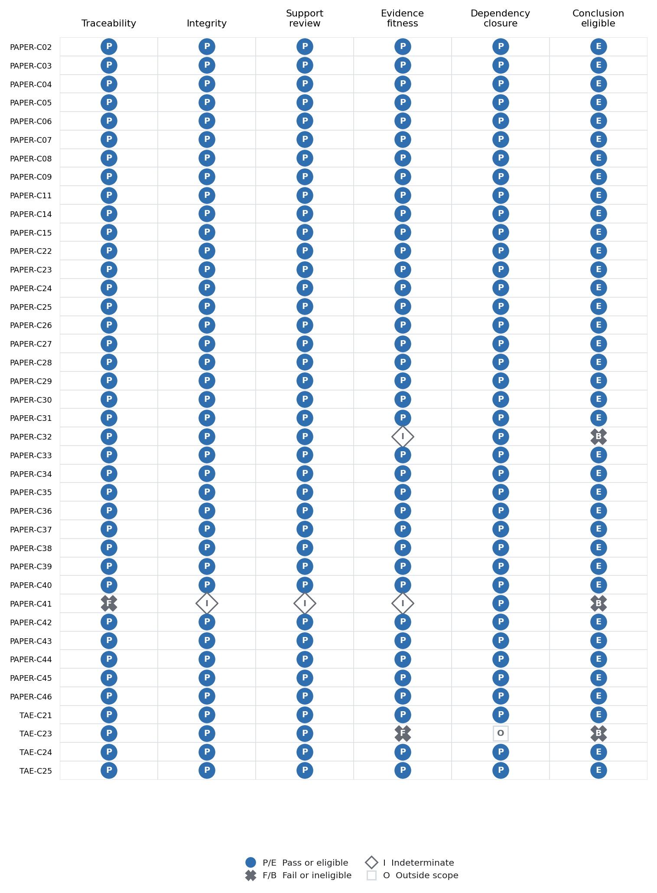

# Trust, Autonomy, and Evidence

[](RESEARCH_STATUS.md)
[](https://github.com/mj3b/trust-autonomy-evidence/releases)
[](https://doi.org/10.5281/zenodo.21841127)
[](https://github.com/mj3b/trust-autonomy-evidence/actions/workflows/validate.yml)
[](LICENSE)
[](https://orcid.org/0009-0001-8121-2878)

## The problem

Institutions increasingly allow AI systems to recommend, plan, communicate, or act across consequential workflows. Claims that these systems are trusted, trustworthy, or subject to human control often leave the evidentiary test unspecified.

This repository asks:

> **What evidence justifies reliance on an autonomous AI system, and what evidence shows that institutional authority can still detect, interrupt, correct, and repair its actions?**

The project develops an evidence architecture for bounded reliance. It identifies the object of reliance, the action being permitted, the governing conditions, and the records an independent reviewer would need to inspect.

## Current contribution

[Version 0.10.0](https://github.com/mj3b/trust-autonomy-evidence/releases/tag/v0.10.0) contributes twenty-one connected artifacts:

1. A conceptual model separating trust, trustworthiness, reliance, justified reliance, and calibration.
2. A six-variable autonomy profile covering goal scope, action authority, temporal horizon, impact radius, oversight distance, and reversibility.
3. A seven-level evidence ladder from assertion through longitudinal accountability.
4. A documentary test for practical human control across access, comprehension, authority, feasibility, exercise, effect, correction, repair, and reform.
5. A solo-validation suite containing 12 synthetic cases, 252 prespecified determinations, 12 mutation tests, three invariance tests, and sealed oracle artifacts.
6. A frozen public-case selection protocol with preserved candidate inputs, search output, exclusions, and selection decisions.
7. Three public evidence packets covering a successful pre-action intervention, formal authority without practical force, and an action sequence whose cause remains indeterminate.
8. A frozen research agenda focused on practical authority, evidence sufficiency, and interacting control conditions.
9. A publication figure set containing six main figures, four appendix figures, ten derived data tables, formal captions, reading guides, and artifact-integrity checks.
10. A machine-readable map connecting 20 material claims to exact evidence locations, human support attestations, evidence-fitness judgments, dependencies, limitations, and reversal conditions.
11. An executable integrity audit that applies five checks and detects 14 prespecified corruptions without changing the released case packets.
12. A research-lineage record, activity log, audit report, and claim-evidence matrix that preserve authorship, AI assistance, open exceptions, and conclusion eligibility.
13. A prereassessment Oko adjudication protocol, frozen evidence universe, six-stage reassessment, and machine-readable change ledger.
14. A 56-source working literature matrix and sentence-level audit covering the registered literature propositions in the full review draft.
15. A frozen formal search containing eight direct queries, fifteen citation seeds, 2,431 deduplicated records, and a closed 89-record author-decision gate.
16. A full methods manuscript with results, discussion, institutional implications, ethics, limitations, and AI-assistance disclosure.
17. A structured table package that preserves exact states and counts in Markdown and journal-ready `booktabs` fragments.
18. A paper-readiness package that keeps independent assessment, inaccessible-record review, authenticated database coverage, and ethics guidance outside the supported claim set.
19. A 27-source full-text ledger that separates eight verified records from nineteen open title-and-abstract reviews.
20. A frozen recovery and residual-risk protocol for 1,087 inaccessible records, plus accountable logs for five authenticated or disciplinary interfaces.
21. A research-agenda discovery log and a 154-artifact release seal that preserve the v0.9 audit while the v0.10 gates remain open.

All 252 determinations and 12 original mutation tests pass under the committed contract. The v0.6.0 adjudication detects all six prespecified corruptions. The v0.9 integrity audit maps 20 material claims and detects all 14 prespecified claim-map corruptions. Two exceptions remain: no independent assessment and incomplete literature-search coverage. The author gate is closed at 89 of 89 decisions. Another 1,087 records lack abstracts and remain open. These results establish internal contract behavior and traceability for the included artifacts. They do not establish independent reliability, field validity, institutional effectiveness, source truth, originality, or improved outcomes.

The v0.10.0 release preserves every earlier release artifact and freezes the next evidence checkpoint before new results are known. Eight of the 27 retained-close sources have a recorded full-text review basis, leaving 19 open. The protocol controls those reviews, recovery of the 1,087 inaccessible records, a reproducible residual-risk sample, and five authenticated or disciplinary-interface searches. The earlier case packets, the v0.3.0 Oko assessment, and the released v0.9 claim audit remain unchanged. Independent assessment remains a separate validity question.

Post-release work has assigned a terminal state to all 27 retained-close sources: 22 verified full text, 3 abstract-only records, 2 inaccessible records, and no open decisions. This working result closes the first v0.10 evidence gate. It does not change the published v0.10.0 snapshot or resolve the 1,087-record recovery gate.

## Featured figure

Figure 2 compares whether assigned human authority became practical control in three historical cases.

[](figures/generated/fig-2-practical-control-chain.svg)

### What the figure tells us

The featured figure asks a simple question: **Could the designated human actually change what the system did?**

Each packet contains evidence that a human held a formal role. The assessed strength and practical consequences differ because authority is only one link in a longer chain:

1. Did the person receive the relevant information?
2. Could they understand it?
3. Did they have authority to intervene?
4. Was intervention realistically possible in the available time?
5. Did they intervene?
6. Did the intervention change the outcome?

In the current v0.6.0 assessment, every Oko stage from access through effect is partially supported. Retrospective participant accounts describe Stanislav Petrov receiving the warning, questioning it, reporting a false alarm, and affecting the decision path. No located contemporaneous command log or official incident record independently records those stages. The partial cells preserve both the account and that missing evidence.

In the Patriot ZG710 case, a human authorized the engagement. The evidence indicates weak comprehension and no feasible or exercised challenge before launch. Formal authority therefore produced no protective effect.

In the F/A-18C case, the public record confirms human authority and some access to information. Missing records prevent conclusions about what operators saw, understood, or could have done in time. Open diamonds marked `I` mean “we do not know.” Gray crosses marked `U` record evidence that a condition failed.

The later reforms shown in both Patriot cases indicate institutional learning. They could not repair the losses already caused.

The central lesson is that assigning a human role does not establish meaningful control. Institutions need separate evidence for timely information, comprehension, authority, opportunity, intervention, and effect.

The current figure derives this pattern from the [27 plotted states](figures/data/fig-2-practical-control-chain.csv). Oko records partial support across the six pre-action stages. Both Patriot packets support formal authority, while the other practical conditions are unsupported or unresolved. The [figure methods](reports/figure-methods.md#derivation-of-the-central-lesson) preserve the formal derivation.

The paper-stage [PR #11 pressure test](paper/review-record-pr11.md) identified the Oko protocol mismatch. The [v0.6 adjudication](reports/oko-evidence-adjudication-v0.6.0.md) resolves it through six reclassifications made under a protocol frozen before reassessment. The decision corrects the current assessment and does not add missing historical evidence.

The figure shows this pattern across three historical cases. It supplies no estimate of how often these failures occur and no prediction of performance in current AI systems.

The [publication figure set](figures/) contains six main figures, four appendix figures, derived data, formal captions, and plain-language reading guides. The [structured tables](paper/tables.md) preserve the exact states and counts behind the graphics.

## Claim-evidence integrity figure

Figure A3 asks a second question: **Is a traceable claim fit to support a conclusion?**

[](figures/generated/fig-a3-claim-evidence-integrity.svg)

Every mapped claim passes traceability, which means its declared evidence locations resolve. Traceability is the first column. The later columns test separate questions: whether the artifact's integrity can be checked, whether a human reviewed support, whether the evidence fits the claim, and whether every dependency closes.

The Oko claim, `PAPER-C04`, passes because it reports partial support and preserves the missing contemporaneous-record limit. The dependent paper conclusion, `PAPER-C09`, also passes within the declared single-assessor procedure. `TAE-C23` remains ineligible because no independent study has tested reliability or field validity. `PAPER-C26` is now eligible within the 89-record queue because every author decision is recorded and Figure 5 resolves from the ledger. The central lesson is simple: claim eligibility depends on matching the conclusion to evidence that is fit for its exact scope.

The matrix uses categorical states and letter labels so color is not the only signal. It calculates no aggregate trust score. The [derived data](figures/data/fig-a3-claim-evidence-integrity.csv), [figure specification](figures/specifications/claim-evidence-integrity.json), and [v0.9 audit report](audits/v0.9.0/audit-report.md) preserve the exact path behind every cell.

## Repository map

| Path | Purpose |
| --- | --- |
| [`README.md`](README.md) | States the research question, current result, reading order, and validation commands. |
| [`RESEARCH_STATUS.md`](RESEARCH_STATUS.md) | Records the release state, completed artifacts, active work, and open empirical questions. |
| [`CLAIMS.md`](CLAIMS.md) | Lists each proposition with its evidence, confidence, limits, and reversal conditions. |
| [`LIMITATIONS.md`](LIMITATIONS.md) | Names validity threats and conclusions outside the current evidence. |
| [`SOURCES.md`](SOURCES.md) | Records the standards, papers, and public repositories used by the project. |
| [`CITATION.cff`](CITATION.cff) | Provides machine-readable authorship, release, license, and DOI metadata. |
| [`CHANGELOG.md`](CHANGELOG.md) | Tracks material changes to concepts, protocols, claims, and evidence requirements. |
| [`CONTRIBUTING.md`](CONTRIBUTING.md) and [`GOVERNANCE.md`](GOVERNANCE.md) | Define contribution evidence, review rules, decision authority, and change records. |
| [`research/`](research/) | Contains the main conceptual paper on justified reliance, autonomy, and practical control. |
| [`research/frozen-research-agenda.md`](research/frozen-research-agenda.md) | Freezes three research topics and one project question for the next public-case cycle. |
| [`research/agenda-discovery-log-v0.10.0.md`](research/agenda-discovery-log-v0.10.0.md) | Records findings that changed the work sequence while preserving the frozen topics and question. |
| [`paper/`](paper/) | Develops the methods paper, formal search, claim register, literature audit, structured tables, references, and publication decisions. |
| [`paper/manuscript-reader.md`](paper/manuscript-reader.md) | Renders the manuscript's citation identifiers as clickable author-year citations with a reference list. |
| [`paper/manuscript-pressure-test-v0.8.0.md`](paper/manuscript-pressure-test-v0.8.0.md) | Records citation, count, claim, reliability, ethics, and submission-gate findings. |
| [`paper/review-record-v0.8.0.md`](paper/review-record-v0.8.0.md) | Records author authorization, reviewed additions, support decisions, and publication limits. |
| [`paper/review-record-v0.9.0.md`](paper/review-record-v0.9.0.md) | Records the 89 author decisions, contribution decision, source boundary, and remaining search limits. |
| [`paper/author-screening-completion-gate.md`](paper/author-screening-completion-gate.md) | Records progress on the 89 author decisions and controls when final search-flow language becomes eligible. |
| [`paper/next-evidence-gates-v0.10.0.md`](paper/next-evidence-gates-v0.10.0.md) | Reports the full-text, inaccessible-record, authenticated-interface, and independence gate states. |
| [`paper/data/close-source-full-text-gate-v0.10.0.csv`](paper/data/close-source-full-text-gate-v0.10.0.csv) | Records one full-text state for each of the 27 retained-close sources. |
| [`paper/data/author-screening-gate-v0.8.0.json`](paper/data/author-screening-gate-v0.8.0.json) | Preserves the open author-gate checkpoint published in v0.8.0. |
| [`paper/data/author-screening-gate-v0.9.0.json`](paper/data/author-screening-gate-v0.9.0.json) | Stores the closed gate, final decision counts, and Figure 5 eligibility state. |
| [`paper/tables.md`](paper/tables.md) | Publishes compact exact-value tables with captions, notes, and interpretation boundaries. |
| [`paper/tables/manuscript-tables.tex`](paper/tables/manuscript-tables.tex) | Provides journal-style `booktabs` fragments with three horizontal rules and no vertical rules. |
| [`evidence/`](evidence/) | Contains the trust evidence register, v0.9 claim-evidence map, research lineage, and AI-assisted activity log. |
| [`evidence/claim-evidence-map.json`](evidence/claim-evidence-map.json) | Connects 20 material claims to exact locators, five fitness dimensions, dependencies, human review, limits, and reversal conditions. |
| [`evidence/research-lineage.json`](evidence/research-lineage.json) | Records people, software, research activities, artifacts, and relations using PROV-O-compatible concepts. |
| [`protocols/`](protocols/) | Defines solo validation, independent review, public-case reconstruction, practical control, and claim-evidence integrity procedures. |
| [`protocols/coe-integrity-audit.md`](protocols/coe-integrity-audit.md) | Defines the five claim gates, four adapted CoE checks, repository-specific closure check, negative controls, and conclusion rule. |
| [`protocols/search-coverage-and-full-text-protocol-v0.10.0.md`](protocols/search-coverage-and-full-text-protocol-v0.10.0.md) | Freezes full-text verification, inaccessible-record recovery, residual-risk sampling, and authenticated-interface completion rules. |
| [`protocols/public-case-reconstruction-protocol.md`](protocols/public-case-reconstruction-protocol.md) | Freezes the source cutoff, candidate pools, eligibility rules, screening order, and reconstruction procedure before case selection. |
| [`cases/`](cases/) | Publishes three case packets, their provenance manifests, assessments, hashes, and admissibility requirements. |
| [`cases/public-case-selection-register.md`](cases/public-case-selection-register.md) | Preserves the frozen collection hashes and every inclusion or exclusion in screening order. |
| [`cases/data/candidate-search-output.json`](cases/data/candidate-search-output.json) | Preserves the deterministic search result from the two candidate collections without redistributing article text. |
| [`schemas/`](schemas/) | Defines machine-readable contracts for synthetic cases, public cases, adjudication, literature support, claim maps, lineage, mutations, and audit results. |
| [`fixtures/`](fixtures/) | Contains 12 synthetic cases, the original mutation suite, six v0.6 adjudication controls, and 14 current claim-integrity controls. |
| [`oracles/`](oracles/) | Stores prespecified expected decisions and the SHA-256 manifest that seals them. |
| [`analysis/`](analysis/) | Implements deterministic assessment logic and builders for the publication figures and claim-evidence matrix. |
| [`assessments/`](assessments/) | Stores generated results plus the current v0.6 Oko assessment and change ledger. |
| [`reports/`](reports/) | Publishes the solo-validation and three-case reconstruction results with explicit claim boundaries. |
| [`figures/`](figures/) | Publishes six main figures, four appendix figures, ten derived CSV files, plotting specifications, and plain-language reading guides. |
| [`reports/figure-methods.md`](reports/figure-methods.md) | Records formal captions, transformations, missingness treatment, and prohibited interpretations for the figure set. |
| [`audits/v0.9.0/`](audits/v0.9.0/) | Publishes the current audit plan, machine-readable result, plain-language report, and two open exceptions. |
| [`audits/v0.8.0/`](audits/v0.8.0/) | Preserves the open author-screening checkpoint as version history. |
| [`audits/v0.6.0/`](audits/v0.6.0/) | Preserves the earlier 15-claim audit as version history. |
| [`scripts/`](scripts/) | Contains candidate-search, packet-sealing, release-manifest, repository-validation, paper-validation, and integrity-audit utilities. |
| [`release/`](release/) | Seals each versioned research package with SHA-256 digests while preserving earlier releases. |
| [`release/v0.10.0-release-notes.md`](release/v0.10.0-release-notes.md) | Explains why the protocol checkpoint is released before the new evidence gates close. |
| [`mappings/`](mappings/) | Relates this work to GDI, HIT, CDFI, and CDCF governance artifacts. |
| [`.github/`](.github/) | Defines automated validation, the pull-request checklist, and structured issue forms. |
| [`requirements-dev.txt`](requirements-dev.txt) and [`LICENSE`](LICENSE) | Pin the validation dependency and state the Apache-2.0 license. |

## How to read the repository

Start with [Trust, Autonomy, and Evidence](research/trust-autonomy-and-evidence.md). Use the [Trust Evidence Register](evidence/trust-evidence-register.md) to translate a reliance claim into inspectable evidence. Read the [current public-case report](reports/public-case-reconstruction-v0.6.0.md), [CLAIMS.md](CLAIMS.md), and [LIMITATIONS.md](LIMITATIONS.md) before applying the model.

The five protocols define solo validation, public-case reconstruction, practical-control assessment, claim-evidence integrity, and future independent evaluation. The public-case selection register must record its freeze commit before candidate screening begins. The mapping files show how this project relates to existing public artifacts without transferring claims among them.

## Repository validation

Install the pinned development dependency and run the validator with Python 3.10 or later:

```bash
python -m pip install -r requirements-dev.txt
python scripts/validate_repository.py
```

The repository validator checks required release files, internal links, version alignment, schemas, source references, sealed packet and release hashes, selection invariants, current case interactions, 252 oracle comparisons, 12 original mutation tests, six adjudication controls, 14 claim-integrity controls, formal-search consistency, literature support, and figure integrity. The paper validator checks author identity, question alignment, at least 45 bibliography entries, the archived v0.6 DOI, current claim eligibility, and the originality-language boundary. Successful runs end with `repository validation: PASS`, `chain-of-evidence audit: PASS_WITH_EXCEPTIONS`, and `paper validation: PASS`.

## Research boundaries

This repository does not establish that:

- an AI system is generally safe or trustworthy;
- a complete decision record is truthful;
- a reviewer understood the evidence;
- formal human authority had practical force;
- a governance artifact satisfies a legal or normative requirement;
- the proposed evidence architecture improves outcomes.

Each proposition requires evidence from the deployment, institution, decision, and review context in which the claim is made.

## Contribution policy

Contributions should identify the proposition being changed, the evidence supporting the change, the limits of that evidence, and the conditions that would reverse the conclusion. See [CONTRIBUTING.md](CONTRIBUTING.md) and [GOVERNANCE.md](GOVERNANCE.md). Case material must exclude personal, confidential, and institutionally restricted information unless the contributor has documented authority to publish it.

## Citation

Version 0.10.0 is the current evidence-gate protocol release. Its version-specific DOI remains pending. Until that DOI is recorded, use the all-versions DOI and identify v0.10.0 as the repository version used for the frozen full-text and search-coverage protocol. The manuscript, figures, claim map, and integrity audit remain at their declared earlier versions.

> Banasihan, M. J. (2026). *Trust, Autonomy, and Evidence* (Version v0.10.0) [Computer software]. Zenodo. Version DOI pending.

The all-versions DOI, [10.5281/zenodo.21841127](https://doi.org/10.5281/zenodo.21841127), resolves to the newest archived version. Machine-readable metadata in [CITATION.cff](CITATION.cff) identifies v0.10.0. Earlier releases remain available through the Zenodo record history.

## Author

Mark Julius Banasihan is an independent applied researcher studying decision authority, human influence, evaluation, and assurance in AI-mediated institutional systems.

[GitHub](https://github.com/mj3b) | [ORCID](https://orcid.org/0009-0001-8121-2878)
